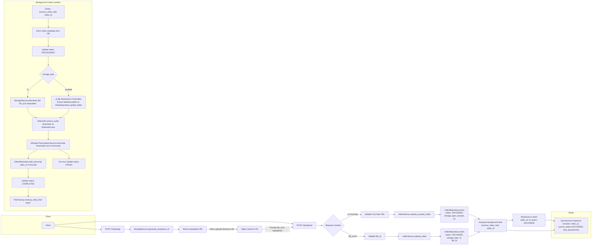

# Complete Flow Diagram

This diagram shows the end-to-end flow: client request → synchronous registration response → queued background processing steps (Celery worker).

Notes:
- The `/api/upload` endpoint returns immediately after registering the video (status UPLOADED) and queues `process_video_task` for asynchronous work.
- Background steps include downloading the source (from R2 or YouTube), audio extraction, transcription, storing transcripts, status updates, and temp file cleanup.
